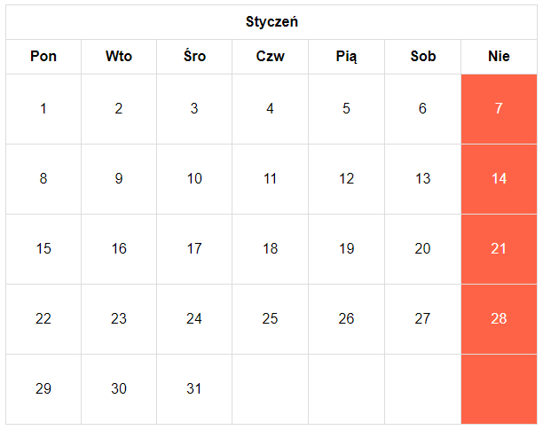

## Kółko i krzyżyk

> W katalogu z ćwiczeniem znajdziesz plik `index.html`. Otwórz go w przeglądarce WWW (wystarczy jeżeli klikniesz na niego dwa razy).  
> Otwórz też pliki przygotowane do tego zadania w wybranym przez siebie edytorze kodu (WebStorm, Visual Studio Code). 

Kod CSS do tego zadania jest już gotowy. Spróbujmy za pomocą HTML wstawić na stronę taką tabelę:

## Kalendarz

> W katalogu z ćwiczeniem znajdziesz plik `index.html`. Otwórz go w przeglądarce WWW (wystarczy jeżeli klikniesz na niego dwa razy).  
> Otwórz też pliki przygotowane do tego zadania w wybranym przez siebie edytorze kodu (WebStorm, Visual Studio Code). 

Kod CSS do tego zadania jest już gotowy. Spróbujmy za pomocą HTML wstawić na stronę taką tabelę:

